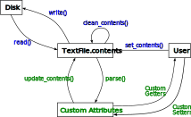
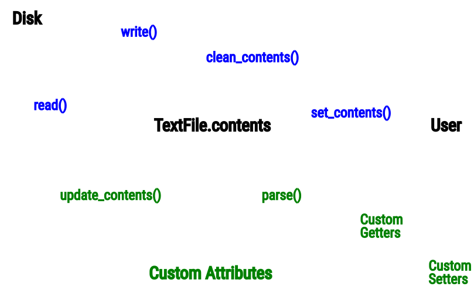

.. include:: ../../constants.rst

.. spelling:word-list::

    aren
    getter
    getters
    Getters
    isn
    ve

.. _section-file_concepts:

File Utility Concepts
=====================

This page explains the concepts behind the :py:class:`pyxx.files.File` class
and derived classes.  Prior to reading this page, it may be helpful to review
the distinctions between `binary files <https://en.wikipedia.org/wiki/Binary_file>`__
and `text files <https://en.wikipedia.org/wiki/Text_file>`__.

General Usage
-------------

The general philosophy behind the the :py:class:`pyxx.files.File` class and
derived classes is that files are simply a means of storing arbitrary data.
From this perspective, user interactions with files through scripting languages
such as Python are merely a means of transforming the data into easier-to-use
formats and performing consistency checks when altering data.

Particularly in coding languages designed for object-oriented programming,
such as Python, it can be useful to interact with the data in a file
indirectly, through object attributes and methods.  These attributes and
methods can handle many of the tedious, complex, or error-prone operations
needed to validate and ensure consistency of data in files.

For example, suppose that we're modifying a text file containing a table with
three columns: dates, numbers, and 10-character strings.  While we could
use Python's ``open()`` and ``read()`` functions to "manually" read the data
from the file, seek to specific positions, and modify the data, this is more
tedious to code and more likely that mistakes (e.g., writing a 9-character
string instead of 10 characters) could occur.  An easier approach would be to
read all the data into a Pandas DataFrame (or similar data structure), and
potentially create functions to write data to the table and ensure it meets
formatting requirements.

The :py:class:`pyxx.files.File` class essentially takes this concept a step
further.  The primary goal is that when interacting with file data, users
interact with the data *through a Python object*, rather than editing it
directly.  This provides several benefits:

- Python functions can be used to perform data processing tasks and
  consistency checks, reducing "manual" work and preventing bugs.
- By using Python classes to represent files, commonly-used code for interacting
  with files can be organized in parent classes and *inherited* by derived
  classes, reducing duplicate code.

Data Model: :py:class:`pyxx.files.File`
---------------------------------------

.. note::

    For examples of how to use the features in this section, refer to the
    :ref:`Basic File Examples <section-tutorials_files_basic>` page.

|PackageNameStylized| considers files in a relatively abstract sense -- simply
as a structured means for storing data on the disk.  Thus, the key objective of
:py:class:`pyxx.files.File` objects is to provide an abstract interface for
interacting with structured data, with the understanding that the data *may or
may not exist as a file on the disk.*

The key intention is that users should be able to derive more specific classes
from :py:class:`pyxx.files.File` with customized members specific to the format
of the users's data.  For instance, if your file contains flight data, you might
want to create a derived class and add a class variable ``airplanes`` listing
all the planes from the file, and create a new method ``parse()`` to populate
the ``airplanes`` variable by reading a file.

While the primary intention of the |PackageNameStylized| file classes is to
provide a basic structure that users can customize for their use case,
|PackageNameStylized| does provide a few generic members in the
:py:class:`pyxx.files.File` class to aid in interacting with any type of file.
A few examples:

- :py:attr:`pyxx.files.File.path`: Files generally are associated with a
  particular location on the disk, and this attribute stores such a location.
  However, note that *the file need not currently exist at this path* -- it
  might also be the location to which the file will be written *in the future.*
- :py:attr:`pyxx.files.File.hashes`: For any file (binary or text) that exists
  on the disk, it should be possible to compute the file's hash, which is useful
  for comparing files.  The |PackageNameStylized| package provides several methods
  for calculating file hashes, such as :py:meth:`pyxx.files.File.compute_file_hashes`,
  and the :py:attr:`pyxx.files.File.hashes` attribute stores the most recently-saved
  set of hashes for the file.

Additional members can be found in the :py:class:`pyxx.files.File` API reference.

Data Model: :py:class:`pyxx.files.TextFile`
-------------------------------------------

.. note::

    To see an example of how to create a custom class for reading,
    parsing, and writing text files, refer to the
    :ref:`Custom File Class Example <section-tutorials_files_custom_class>` page.

A text file stores data as lines of readable text, and |PackageNameStylized|
provides a greater range of "out-of-the-box" functionality for interacting
with text files through the :py:class:`pyxx.files.TextFile` class.

On a general level, there are two ways that users may typically want to
interact with data in text files: (1) viewing the raw data (e.g., iterating
through each line), and (2) interacting with the data through an abstracted
interface.  |PackageNameStylized| aims to be flexible enough to support both
approaches.

At a high level, data in :py:class:`pyxx.files.TextFile` are organized as shown
in the diagram below.

In this flowchart, the **blue text** represents methods built into the
:py:class:`pyxx.files.TextFile` class, and the **green text** represents
members that should be customized by the user (more detail in next section).

Next we'll take a closer look at a few of the items in the flowchart.

``TextFile.contents``
^^^^^^^^^^^^^^^^^^^^^

This represents the :py:attr:`pyxx.files.TextFile.contents` attribute.  Text
files store data as lines of characters, and this attribute mimics this
structure: the ``contents`` list is a list of strings, where each
item in the list is a line from the text file.

As mentioned previously, one of the use cases |PackageNameStylized| facilitates
is allowing users to iterate through lines of the file; the ``contents`` list
is the means by which this is accomplished.

There are also certain operations that may modify the ``contents`` list in-place.
For instance, the :py:meth:`pyxx.files.TextFile.clean_contents` method edits
the ``contents`` list to remove items such as comments or blank lines from the
file.

Disk, ``read()``, and ``write()``
^^^^^^^^^^^^^^^^^^^^^^^^^^^^^^^^^

|PackageNameStylized| provides several ways to interact with text files on the
disk.  The ``read()`` and ``write()`` methods shown in the flowchart above
move data from the disk to the ``contents`` list and vice versa, respectively.

These methods also automatically perform tasks such as computing file hashes,
so that, for instance, after reading the file you can tell at any point whether
it has changed by simply calling the :py:meth:`pyxx.files.TextFile.has_changed`
method.

``set_contents()``
^^^^^^^^^^^^^^^^^^

Reading and writing aren't the only ways to add content to a text file.  As
mentioned previously, |PackageNameStylized| does not assume that the file is
necessarily stored on the disk.  In alignment with this philosophy, the data
stored in a file can come from an arbitrary source, not necessarily read from
the disk.  To do so, simply call the :py:meth:`pyxx.files.TextFile.set_contents`
method with the desired lines of text in the file.  Then, you can perform any
of the other actions (such as using ``clean_contents()``) the same way you
would have if the file were read from the disk.

Custom Attributes, Getters, and Setters
^^^^^^^^^^^^^^^^^^^^^^^^^^^^^^^^^^^^^^^

Often, interacting with files is much more intuitive, particularly in an
object-oriented language like Python, when interactions occur through
abstracted interfaces.  For instance, if we're parsing a scientific file
for performing finite element analysis, rather than navigating to Line 82 of
a text file and reading the mesh size, it's arguably much simpler to parse the
file contents and then use the value by ``myFile.mesh_size``.

This is the primary intention of the :py:mod:`pyxx.files` module: by setting
up classes to represent files, user interaction can occur through the class's
attributes, rather than directly manipulating lines of the file.

**Custom Attributes**: Thus, any classes derived from :py:class:`pyxx.files.TextFile`
should define custom class variables relevant to the data in the file.  This isn't
provided out-of-the-box by |PackageNameStylized|, since the precise choice of
attributes will be specific to your file.

**Custom Getters and Setters**: In addition, you may want to define custom "getters"
and "setters" -- methods for retrieving and storing data.  For instance, you may
want a custom method that converts the units of data before returning it, or before
you set an attribute, you may want to validate its value to ensure consistency of
the data in the file or for security reasons.

``update_contents()`` and ``parse()``
^^^^^^^^^^^^^^^^^^^^^^^^^^^^^^^^^^^^^

As we've seen, :py:class:`pyxx.files.TextFile` provides two primary ways to
interact with data in text files: (1) the ``contents`` list and (2) custom
attributes (along with custom getters and setters).  The ``update_contents()``
and ``parse()`` methods provide a translation mechanism between these two
ways of changing file data.

More specifically:

- The :py:meth:`pyxx.files.TextFile.parse` method should parse the file
  contents and read it into the file's custom attributes so that users can
  easily interact with the data through an abstract interface.
- The :py:meth:`pyxx.files.TextFile.update_contents` method performs the
  reverse action, using the data in the class's custom attributes to
  construct each line of the text file, and saving it into the ``contents``
  list.

Note that both of these methods are heavily dependent on the exact format of
the text file.  Thus, in the parent :py:class:`pyxx.files.TextFile` class,
they are simply "empty" methods that do nothing, with the intention that users
will override them in derived classes, as discussed in the next section.

Customizing ``TextFile`` Subclasses
-----------------------------------

.. note::

    To see an example of how to create a custom class for reading,
    parsing, and writing text files, refer to the
    :ref:`Custom File Class Example <section-tutorials_files_custom_class>` page.

Based on the data model for the :py:class:`pyxx.files.TextFile` class
introduced in the previous section, it should be fairly straightforward to see
what customizations need to be introduced to customize a subclass.

First, make sure you understand the structure of your file.  Identify key pieces
of data in the file that users may want to read or write, and add class variables
(or better yet, `Python properties <https://realpython.com/python-property/>`__!)
and add them to your subclass, and getter and setter methods to retrieve and
store data in the file, performing any necessary validation steps.

For instance, if you're creating a custom subclass ``VehicleDataFile`` for
files that store data about a car, you might define Python properties such as
``VehicleDataFile.last_oil_change`` or ``VehicleDataFile.engine_power``.
Furthermore, you might define a "getter" method
``VehicleDataFile.get_engine_power(units: str)`` that allows users to specify
units of power and then automatically performs unit conversions when returning
engine power.  Or you might create a custom "setter" method
``VehicleDataFile.set_oil_change(date)`` that allows users to set the date of
the last oil change, and checks that the user's input is a valid date before
storing it.

Second, once you've defined custom attributes and methods for storing and
interacting with data in the file, you'll need to override the
:py:meth:`pyxx.files.TextFile.parse` and
:py:meth:`pyxx.files.TextFile.update_contents` methods to determine how to
translate the data in the custom attributes to and from the lines of text in
the file.  For an example of how to do this, take a look at the
:ref:`Custom File Class Example <section-tutorials_files_custom_class>`.
